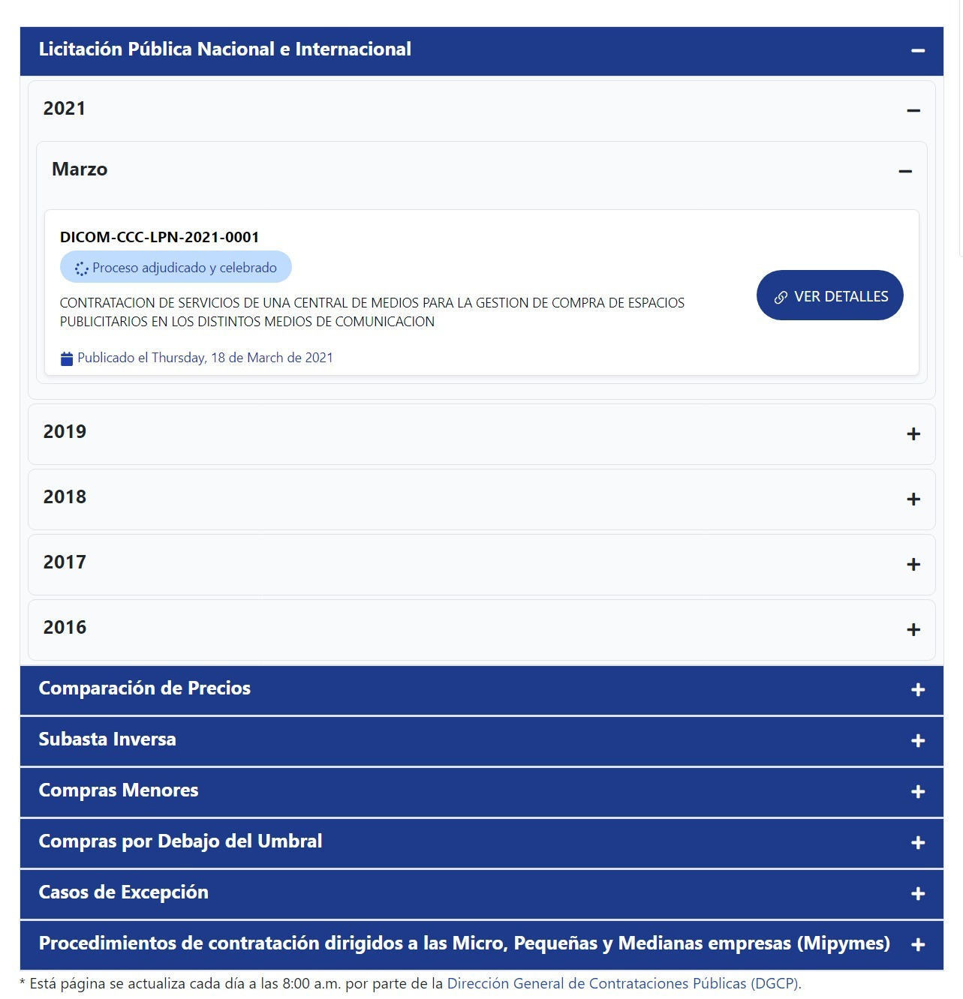

# Módulo Joomla de la Dirección General de Contrataciones Públicas

Este módulo permite obtener y mostrar de manera elegante y moderna los detalles de los procesos de compra gestionados a través del Sistema Electrónico de Contrataciones Públicas (SECP).

## Características
El módulo cuenta con las siguientes características:

- Interfaz moderna y elegante que facilita la visualización de los detalles de los procesos de compra.
- Integración sencilla con el Sistema Electrónico de Contrataciones Públicas (SECP).
- Personalización de la apariencia y estilo del módulo para adaptarlo a las necesidades de la página web.
- Compatibilidad con la última versión de Joomla.

## Requisitos
Para utilizar este módulo, es necesario contar con los siguientes requisitos:

- Una versión de Joomla 3.x o superior.
- Acceso al Sistema Electrónico de Contrataciones Públicas (SECP).

## Instalación
Para instalar el módulo, simplemente sigue los siguientes pasos:

1. Descarga el archivo ZIP del módulo.
2. Accede al panel de administración de Joomla.
3. En el menú lateral, selecciona "Extensiones" y luego "Gestor de extensiones".
4. Haz clic en el botón "Seleccionar archivo" y selecciona el archivo ZIP del módulo.
5. Haz clic en el botón "Subir e instalar".

Una vez instalado el módulo, podrás utilizarlo en tu sitio web de Joomla.

## Uso
Para utilizar el módulo, simplemente añádelo a la página web donde deseas mostrar los detalles de los procesos de compra gestionados a través del SECP. Puedes personalizar su apariencia y estilo para que se adapte a la estética de tu página web.

## Créditos
Este módulo ha sido desarrollado por [Ivan Mercedes](https://ivanmercedes.com).